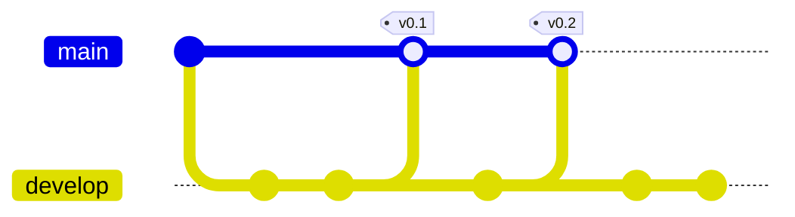
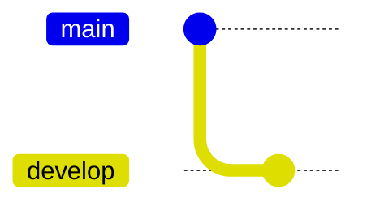

# **Content**

1. [What is GitFlow and getting started](./Intro%20to%20Git%20Flow.md)
2. Develop and Main branches (_here_)
3. [`Features` branches](./Feature%20branches.md)
4. [`Release` branches](./Git%20flow%20release.md)
5. [`Hotfix` branches](./Git%20flow%20hotfix.md)
6. [Troubleshooting examples](./Git%20flow%20troubleshooting.md)
7. [A summary of GitFlow](./A%20Summary%20of%20Git%20Flow.md)

## **Develop and Main branches**

This workflow uses two primary branches to record the development of the project. The first, `Main` (also called `Master`) serves to store the different versions of the project, the commits made on this branch should include tags with a version number (i.e. v0.1.1, v1.0.2). 

The second branch, `Develop` serves as a means to integrate different features. It comes out of the `Main` branch. An example workflow is shown below.


### **Creation**

To create a `Develop` branch from the `Main` branch you can type the commands:

```bash
    git branch develop
    git push -u origin develop
```
Or you can use the tool to assist you by typing

```bash
    git flow init
```
Either way should initialize or workflow as follows

