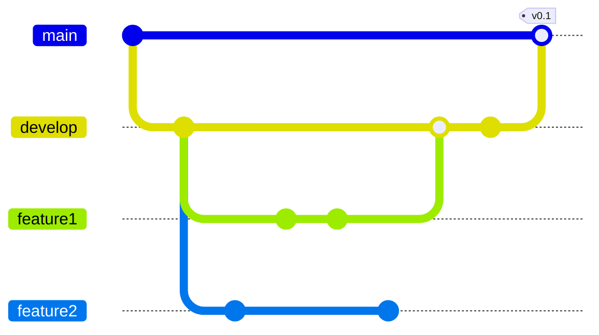
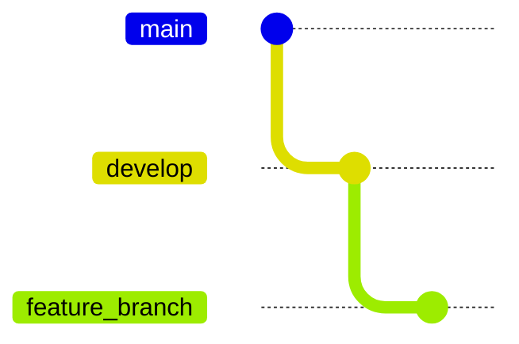
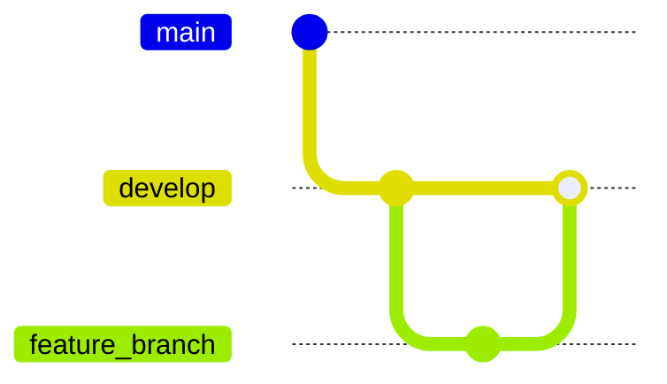

# **Content**

1. [What is GitFlow and getting started](./Intro%20to%20Git%20Flow.md)
2. [`Develop` and `Main` branches](./) 
3. Features branches (_here_)
4. [`Release` branches](./)
5. [`Hotfix` branches](./)
6. [A summary of GitFlow](./A%20Summary%20of%20Git%20Flow.md)

## **Feature branches**

Each new feature must exist in its own branch. These grow out of the `Develop` branch and when the feature is completed, it gets merged back into the `Develop` branch. Features should never interact directly with the `Main` branch. An example of this principle can be seen on the workflow below. 



Note that `Feature` branches can be merged into `Develop` at any time. The last example shows two `Feature` branches created at the same time but since feature 1 is already done, it can be merged into `Develop` and then into `Main` while the feature 2 is being work on. This can cause merge conflicts at some point.

### **Creating a Feature branch**

To create a `Feature` branch from the `Develop` branch you can type the commands:

```bash
    git checkout develop
    git checkout -b feature_branch
```
Or you can use the tool to assist you by typing

```bash
    git flow feature start feature_branch
```
Either way should initialize or workflow as follows



### **Finishing a Feature branch**

When the development of the feature is comple you merge the branch into the `Develop` branch by typing:

```bash
    git checkout develop
    git merge feature_branch
```

Or using the extension...


```bash
    git flow feature finish feature_branch
```

Should look something like this




###### Written by: Jamel Castillo Mejía, Endava. 2023.