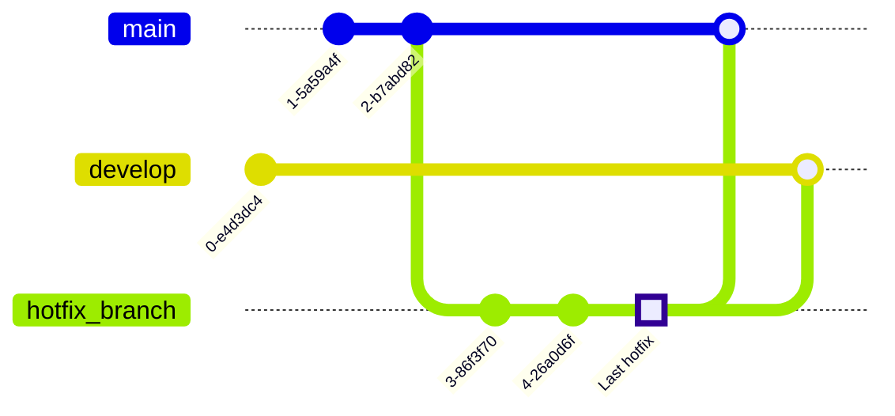

# **Content**

1. [What is GitFlow and getting started](./Intro%20to%20Git%20Flow.md)
2. [`Develop` and `main` branches](./Develop%20and%20Main%20Branches.md)
3. [`Features` branches](./Feature%20branches.md)
4. [`Release` branches](./Git%20flow%20release.md) 
5. Hotfix branches (_here_)
6. [Troubleshooting examples](./Git%20flow%20troubleshooting.md)
7. [A summary of GitFlow](./A%20Summary%20of%20Git%20Flow.md) 


# **Hotfix Branches**

Maintenance or “`hotfix`” branches are used to quickly patch production releases. `Hotfix` branches are a lot like `release` branches and `feature` branches except they're based on `main` instead of `develop`. This is the only branch that should fork directly off of `main`. As soon as the fix is complete, it should be merged into both `main` and `develop` (or the current release branch), and `main` should be tagged with an updated version number.

Having a dedicated line of development for bug fixes allows the team a place to address issues without interrupting the rest of the workflow or waiting for the next release cycle. A maintenance branch can be 
thought as an ad hoc `release` branch that works directly with `main`. A `hotfix` branch can be created using the following methods:

Without the `git-flow` extensions:
```bash
git checkout main
git checkout -b hotfix_branch
```
When using the `git-flow` extensions: 
```bash
$ git flow hotfix start hotfix_branch
```
Which would look something like this in the git graph:


Similar to finishing a `release `branch, a `hotfix` branch gets merged into both `main` and `develop`.
```bash
git checkout main
git merge hotfix_branch
git checkout develop
git merge hotfix_branch
git branch -D hotfix_branch
$ git flow hotfix finish hotfix_branch
```
So the graphic representation of a `hotfix` branch lifecycle is along the following:  



----