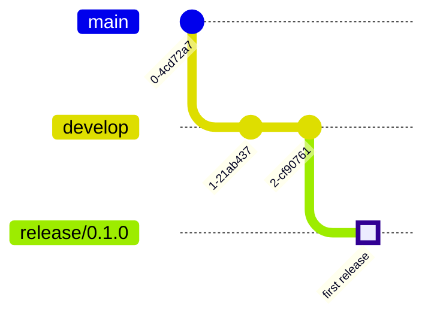
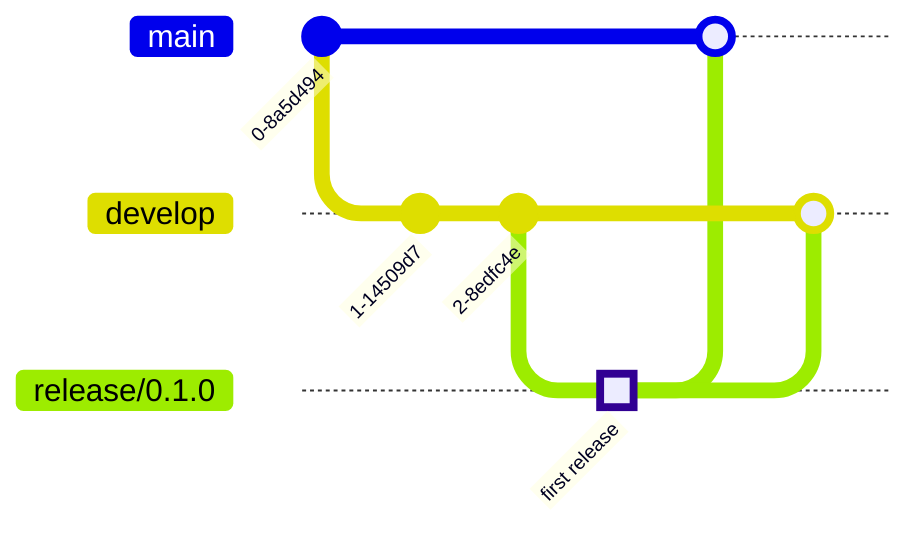

# **Content**

1. [What is GitFlow and getting started](./Intro%20to%20Git%20Flow.md)
2. [`Develop` and `main` branches](./Develop%20and%20Main%20Branches.md)
3. [`Features` branches](./Feature%20branches.md)
4. Release branches (_here_)
5. [`Hotfix` branches](./Git%20flow%20hotfix.md)
6. [Troubleshooting examples](./Git%20flow%20troubleshooting.md)
7. [A summary of GitFlow](./A%20Summary%20of%20Git%20Flow.md) 


# **Release Branches**

The `git-flow` `release` branch has the shortest lifespan of all the `git-flow` branches. It is only created when the `develop` branch has acquired enough features for a release (or a release date is approaching determined in advance), and it is merged with the `master` branch once final testing is done. The `git-flow` `release` branch is then merged back into `develop` and focus goes back to development and hotfixes.

In more detail, the idea is to fork a `release` branch off of `develop`. Creating this branch starts the next release cycle, so no new features can be added after this point. The only changes in this branch should only be bug fixes, documentation generation, and other release-oriented tasks. Meaning no new development is allowed to happen on the `git-flow` `release` branch. When created, the only commits made to this branch should be for bug fixes and urgently necessary chores. No feature development is allowed. Once it's ready to ship, the `release` branch gets merged into `main` and tagged with a version number. In addition, it should be merged back into `develop`, which may have progressed since the release was initiated.

Using a dedicated branch to prepare releases makes it possible for one team to polish the current release while another team continues working on features for the next release, which is especially convenient when working with agile methodologies. It also creates well-defined phases of development to keep everybody in the same track (e.g., it's easy to say, “This week we're preparing for version 4.0,” and to actually see it in the structure of the repository).

Making `release` branches is a straightforward branching operation. Like `feature` branches, release branches are based on the `develop` branch. A new `release` branch can be created using the following methods.

Without the `git-flow` extensions:

```bash
git checkout develop
git checkout -b release/0.1.0
```

When using the `git-flow` extensions:

```bash
$ git flow release start 0.1.0
Switched to a new branch 'release/0.1.0'
```

All this looks something like:


Once the release is ready to ship, it will get merged it into `main` and `develop`, then the `release` branch will be deleted. It’s important to merge back into `develop` because critical updates may have been added to the `release` branch and they need to be accessible to new features.

To finish a release branch, use the following methods:

Without the `git-flow` extensions:

``` bash
git checkout main
git merge release/0.1.0
```

Or with the `git-flow` extension:
```bash
git flow release finish '0.1.0'
```

And that looks a bit like the following:

In summary, the key features of the `git-flow` `release` branch are:

- The `release` branch represents a complete feature set.
- The only commits on the `release` branch are for bug fixes and important chores.
- The `git-flow` release branch is created off the `development` branch.
- `git-flow` `release` is merged into `master` and also back into `development`.
- The `release` branch is the shortest lived of all `git-flow` branches.

----
