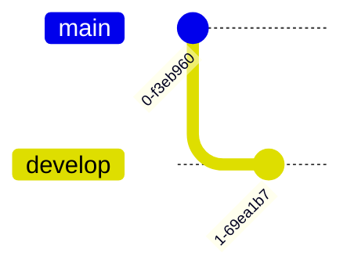
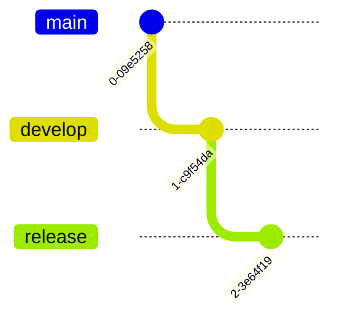
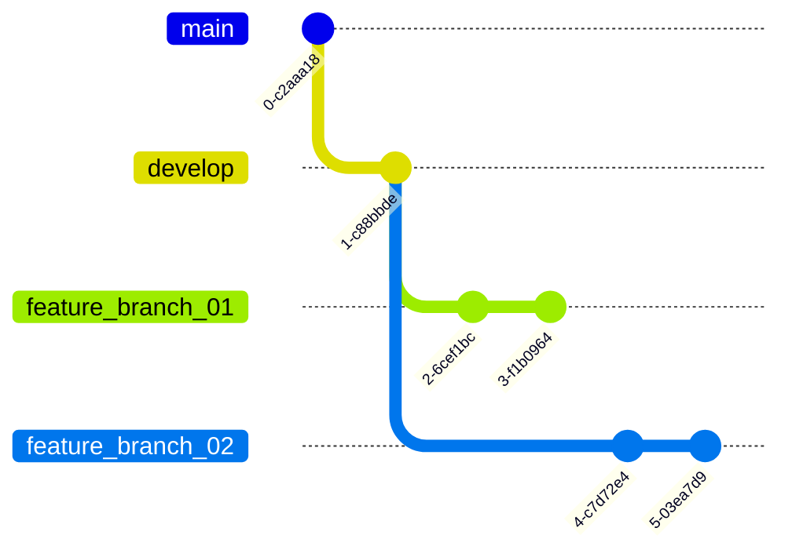

# **Content**

1. [What is GitFlow and getting started](./Intro%20to%20Git%20Flow.md)
2. [`Develop` and `main` branches](./)
3. [`Features` branches](./)
4. Release branches (_here_)
5. [`Hotfix` branches](./)
6. [A summary of GitFlow](./A%20Summary%20of%20Git%20Flow.md) 


# **Release Branches**

Once the `develop` branch has acquired enough features for a release (or a predetermined release date is approaching), you fork a `release` branch off of `develop`. Creating this branch starts the next release cycle, so no new features can be added after this point—only bug fixes, documentation generation, and other release-oriented tasks should go in this branch. Once it's ready to ship, the `release` branch gets merged into `main` and tagged with a version number. In addition, it should be merged back into `develop`, which may have progressed since the release was initiated.

Using a dedicated branch to prepare releases makes it possible for one team to polish the current release while another team continues working on features for the next release. It also creates well-defined phases of development (e.g., it's easy to say, “This week we're preparing for version 4.0,” and to actually see it in the structure of the repository).

Making `release` branches is another straightforward branching operation. Like `feature` branches, release branches are based on the `develop` branch. A new `release` branch can be created using the following methods.

Without the `git-flow` extensions:

```bash
git checkout develop
git checkout -b release/0.1.0
```

When using the `git-flow` extensions:

```bash
$ git flow release start 0.1.0
Switched to a new branch 'release/0.1.0'
```

Once the release is ready to ship, it will get merged it into `main` and `develop`, then the `release` branch will be deleted. It’s important to merge back into `develop` because critical updates may have been added to the `release` branch and they need to be accessible to new features. If your organization stresses code review, this would be an ideal place for a pull request.

To finish a release branch, use the following methods:

Without the `git-flow` extensions:

``` bash
git checkout main
git merge release/0.1.0
```

Or with the `git-flow` extension:
```bash
git flow release finish '0.1.0'
```


    




ejemplo



ejemplo


_Note_: 

----

###### Written by: Luz Mariana Pulido Arcia, Endava. 2023.