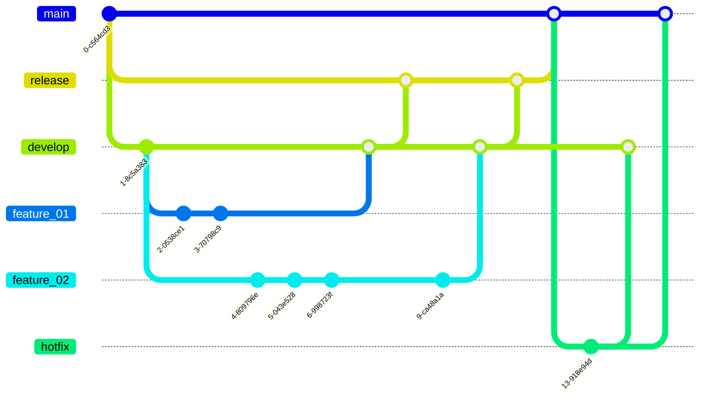

# **What is Gitflow?**

Gitflow is an alternative Git branching model that involves the use of feature branches and multiple primary branches. It was first published and made popular by [Vincent Driessen at nvie](http://nvie.com/posts/a-successful-git-branching-model/). Under this model, developers create a feature branch and delay merging it to the main trunk branch until the feature is complete. These long-lived feature branches require more collaboration to merge and have a higher risk of deviating from the trunk branch. They can also introduce conflicting updates.

Gitflow is a legacy Git workflow that was originally a disruptive and novel strategy for managing Git branches. Gitflow has fallen in popularity in favor of trunk-based workflows, which are now considered best practices for modern continuous software development and DevOps practices. Gitflow also can be challenging to use with CI/CD.

The following diagram can show a GitFlow:

### **Getting started**

As this is an abstract idea of a Git workflow, we can use Gitflow in the command-line using the basic git commands.

But there's another option to use Gitflow that can be more easier in terms of writing commands, so if you decide to use this way, you can install a tool called `git-flow`, so on OSX systems, you can run `brew install git-flow`, or on Windows you'll need to [download and install the tool](https://git-scm.com/download/win). 

After this, you can type the first command that allows you to initialize the repository with the Gitworkflow configuration : `git flow init` that is and extension for the command `git init`, so you can create new branches, etc, more easily.

In the next tutorials, you'll see how to work with this flow using Gitflow using basic git commands and the "new" git-flow commands. 